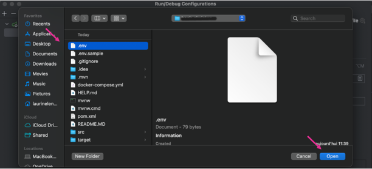

# Your backend API

## Set up 
1. Copie-colle le .env.sample en .env
2. Fait un `docker-compose up`
3. Rajoute le pluggin : https://plugins.jetbrains.com/plugin/7861-envfile
4. 
5. 
6. 

### Database
1. Crée une nouvelle base de donnée Postgre avec le nom de la base de donnée qui est dans le .env et les différent paramètres
2. Test connection & Apply
3. Tu run ensuite TABLES puis DEFAULT_ENTRIES. 
4. 

#

### Quelques specifications

##### - Run DROP uniquement si tu veux refaire les tables 
##### - Pour refaire un compose up, supprime le precedent contenaire crée, ou crée en un avec un nom différent
##### - Si les premières données sont entrées manuellement, il faudra faire le post un nombre de fois égale au nombre initiales de données entrées manuellement avant de pouvoir ajouter de nouvelles données dans la BD 
##### - Seul un utilisateur ADMIN peut créer une image
##### - Seul un ADMIN peut changer l'image d'un film
##### - Seul le createur d'un Rate peut en modifier son contenu ou le supprimer
##### - Tests de non-regression effectués sur postman, si la colonne "image" ne s'affiche pas directemnt, veuillez redemarrer docker ou votre PC 

###### A ajouter dans le application properties
```
spring.datasource.url=jdbc:postgresql://localhost:5432/database_java
spring.datasource.username=root
spring.datasource.password=1234
spring.servlet.multipart.max-file-size=20MB
spring.servlet.multipart.max-request-size=20MB 
```

###### Bien télécharger les dépendances

		<dependency>
			<groupId>org.mapstruct</groupId>
			<artifactId>mapstruct-processor</artifactId>
			<version>1.4.2.Final</version>
			<scope>provided</scope>
		</dependency>
